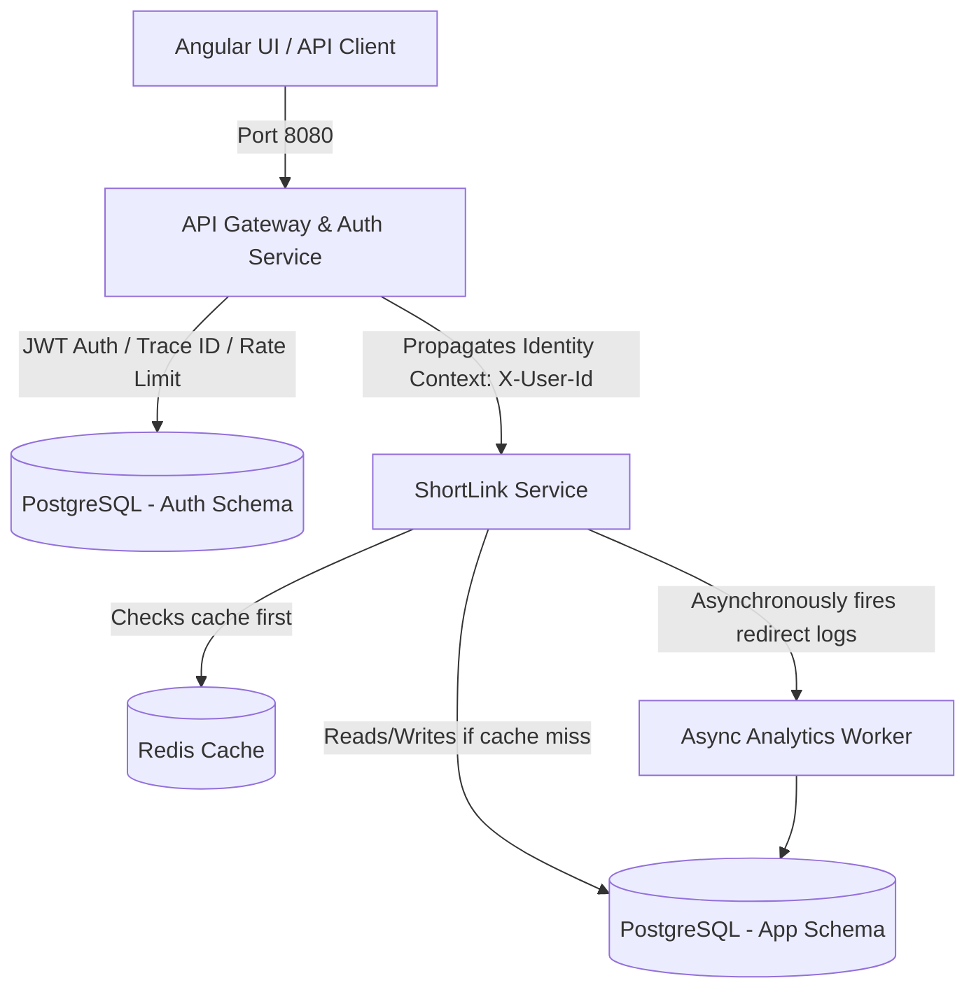

# ShortLinkX - Enterprise Distributed URL Shortener

ShortLinkX is a production-grade, distributed microservice platform built to shorten URLs, provide high-performance redirection, gather link telemetry, and secure client access.

## Repository Information
* **Repository URL**: [ShortlinkX on GitHub](https://github.com/vinaykumaru2k3/ShortlinkX.git)

---

## Architecture Overview

The system is structured as a Maven multi-module project comprising the following modules:

```
ShortLinkX/
  ├── common/             # Shared classes (DTOs, Exception models, Trace Filters)
  ├── api-gateway/        # Edge Routing, Spring Security, JWT validation, Resilience4j, Rate Limiting
  ├── shortlink-service/  # Core Business Logic, Base62 generation, PostgreSQL, Redis cache, Async Analytics
  └── frontend/           # Angular 17+ Single-Page Application (SPA) dashboard client
```

### System Architecture Diagram


---

## Key Features

1. **Edge Router & Security Gateway**: Central gateway on port `8080` intercepts all traffic, validates JWT authorization tokens, configures CORS/CSRF guards, and forwards requests.
2. **Identity Header Propagation**: Once verified, the gateway extracts the caller's details and forwards them downstream to the microservices using secure custom headers (`X-User-Id`), keeping backend services stateless.
3. **Link History per User**: Users can view their personalized list of generated URLs and telemetry data in the dashboard.
4. **Log Tracing (Correlation IDs)**: Log tracing propagates a unique `X-Correlation-ID` MDC context from Gateway down to Services to ease debugging in production.
5. **Sub-millisecond Redirections (Redis Cache)**: Caches `shortCode -> originalUrl` mappings in Redis with configurable TTL expirations.
6. **Asynchronous Link Telemetry**: Redirection lookups immediately redirect the user, while tracking metrics (geography, referral, OS, browser) asynchronously in a non-blocking background thread.
7. **Resilience & Fallbacks (Circuit Breaker)**: Utilizes Resilience4j on Gateway routes to automatically handle downstream microservice outages and fail gracefully.
8. **Flyway Migrations**: Production-grade version-controlled SQL scripts define schema setups instead of unsafe Hibernate auto-generations.

---

## Tech Stack

* **Language**: Java 21
* **Framework**: Spring Boot 4.0.6 (and corresponding Spring Cloud)
* **Frontend**: Angular 17+ (TypeScript, SCSS)
* **Database**: PostgreSQL (JPA/Hibernate)
* **Cache & Rate-limiting**: Redis (Reactive & Standard)
* **API Documentation**: Springdoc OpenAPI (Swagger UI integrated at Gateway)
* **Testing**: JUnit 5, Mockito, Spring Boot Test
* **Containerization**: Docker, Docker Compose
* **CI/CD**: GitHub Actions

---

## Getting Started

### Prerequisites
* Docker & Docker Compose
* Java 21 JDK (to compile locally)
* Maven 3.9+

### Running the Complete Stack
1. Clone the repository:
   ```bash
   git clone https://github.com/vinaykumaru2k3/ShortlinkX.git
   cd ShortlinkX
   ```
2. Build and run via Docker Compose:
   ```bash
   docker compose up --build
   ```
3. Access components:
   * **Frontend UI Dashboard**: `http://localhost:4200`
   * **API Gateway & Swagger Docs**: `http://localhost:8080/swagger-ui.html`

---

## API Documentation

APIs are unified and exposed through the gateway on port `8080`:

| Method | Endpoint | Description | Auth Required |
| :--- | :--- | :--- | :--- |
| `POST` | `/api/v1/auth/register` | Register a new user account | No |
| `POST` | `/api/v1/auth/login` | Login and obtain a JWT bearer token | No |
| `POST` | `/api/v1/shorten` | Generate a new base62 shortened URL | Yes (JWT) |
| `GET` | `/api/v1/urls` | Retrieve history of shortened links for user | Yes (JWT) |
| `GET` | `/api/v1/{shortCode}` | Resolve and redirect short URL | No |
| `GET` | `/v3/api-docs` | Fetch OpenAPI specifications JSON | No |
