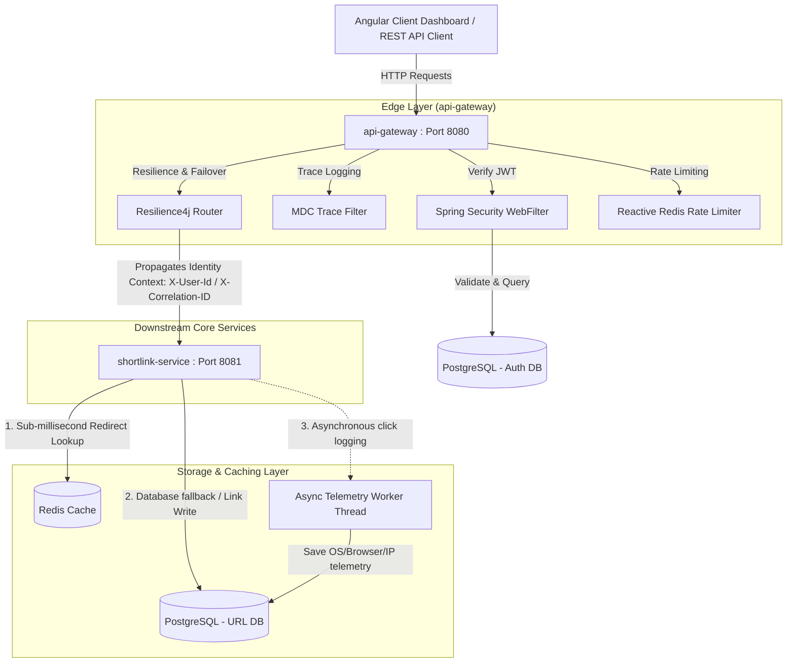

# ShortLinkX - Enterprise Distributed URL Shortener

ShortLinkX is a production-grade, distributed microservice platform built to shorten URLs, provide high-performance redirection, gather link telemetry, and secure client access.

## Repository Information
* **Repository URL**: [ShortlinkX on GitHub](https://github.com/vinaykumaru2k3/ShortlinkX.git)

---

## Architecture Overview & System Design

ShortLinkX is designed following modern cloud-native architectural patterns. By splitting concerns into specialized services, the system guarantees high-performance URL redirection, secure multi-tenant isolation, and sub-millisecond API response latency.

### 1. Multi-Module Project Topology
The project is structured as a Maven reactor build, providing code separation and clean boundaries:

```
ShortLinkX/
  ├── common/             # Shared library containing centralized DTO records, global exceptions, and interceptor contracts.
  ├── api-gateway/        # Reactive edge gateway serving security, rate-limiting, Resilience4j circuit breaking, and user sign-in/registration.
  ├── shortlink-service/  # Core business domain microservice managing short URL generation, Base62 logic, Redis caching, and async telemetry.
  └── frontend/           # Angular SPA client dashboard styled with a modern glassmorphic theme.
```

---

### 2. High-Level Architecture Flow
The following system design shows how requests flow from the Client through the Edge Gateway to downstream microservices and backing databases:



---

### 3. Detailed Data Flows & Core Lifecycles

#### A. Creating a Shortened URL (Write Flow)
1. **Authentication**: The client sends a `POST /api/v1/shorten` request with a JSON payload containing the original URL, accompanied by a `Authorization: Bearer <JWT>` header.
2. **Gateway Verification**: The `api-gateway` intercepts the request:
   - Validates the signature, integrity, and expiration of the JWT.
   - Extracts the `userId` and `username` from the JWT claims.
   - Injects the downstream identity headers `X-User-Id` and `X-User-Name`.
   - Generates and attaches a unique `X-Correlation-ID` header if not present.
3. **Service Logic**: The `shortlink-service` receives the request:
   - Extracted headers associate the write request with the logged-in user.
   - Converts the next autoincrement ID sequence from the database using a **Base62 Encoding** algorithm to generate the unique shortened code.
   - Saves the mapping record to the `urls` table in PostgreSQL.
   - Populates the Redis cache with the mapping (`shortCode` -> `originalUrl`) with a TTL of 7 days to accelerate future redirection requests.

#### B. Resolving and Redirecting a Short URL (Read Flow)
1. **Client GET**: A browser requests redirection via `GET /api/v1/{shortCode}` (exposed publicly through the gateway).
2. **Sub-millisecond Cache Match**: The `shortlink-service` checks the Redis cache first:
   - **Cache Hit**: Instantly retrieves the `originalUrl` from Redis.
   - **Cache Miss**: If absent in Redis, it queries the database, updates the Redis cache for subsequent hits, and retrieves the URL.
3. **Immediate HTTP 302**: The service returns a standard `302 Found` redirection header back to the browser immediately, minimizing user latency.
4. **Asynchronous Telemetry Dispatch**: Simultaneously, the service spawns an asynchronous background worker using Spring's `@Async` thread executor:
   - Resolves click details (IP address, User-Agent header, Operating System, Browser).
   - Writes the telemetry event to the `analytics` database table without blocking the client's HTTP response stream.

---

### 4. Enterprise Architecture Features

* **Distributed Database Pattern**: Follows the *Database-per-Service* microservice pattern. Authentication tables run in `postgres-auth` on port `5430`, while Shortcode/Analytics tables run in `postgres-url` on port `5431`. This eliminates database coupling.
* **Identity Context Propagation**: Downstream microservices remain entirely stateless and decoupled from the security database. Downstream services do not validate tokens or run SQL queries to verify user roles; they trust the `X-User-Id` injected securely by the gateway.
* **Observability (MDC Tracing)**: A custom gateway filter creates a unique correlation trace ID which is propagated across all downstream microservice HTTP boundaries. Logging configurations output this token inside their MDC (Mapped Diagnostic Context) blocks, making it simple to trace a request end-to-end across multiple containers.
* **Schema Migration Control (Flyway)**: Database setups are fully versioned and automated. Flyway applies schema migration scripts (`V1`, `V2`, `V3`) on service startup, preventing schema drift across local, staging, and production environments.

---

## Tech Stack

* **Language**: Java 21
* **Framework**: Spring Boot 4.0.6 (and corresponding Spring Cloud)
* **Frontend**: Angular 17+ (TypeScript, SCSS)
* **Database**: PostgreSQL (JPA/Hibernate)
* **Cache & Rate-limiting**: Redis (Reactive & Standard)
* **API Documentation**: Springdoc OpenAPI (Swagger UI integrated at Gateway)
* **Testing**: JUnit 5, Mockito, Spring Boot Test
* **Containerization**: Docker, Docker Compose
* **CI/CD**: GitHub Actions

---

## Getting Started

### Prerequisites
* **Docker & Docker Compose** (Desktop/Engine v20.10+)
* **Java 21 JDK** (to compile/run locally without containers)
* **Node.js & npm** (optional, for running/developing the frontend locally)
* **Maven 3.9+** (optional, wrapper `./mvnw` is included)

### Running the Complete Stack (Docker Compose)
The entire multi-service system is orchestrated using Docker Compose. This starts all database engines, the Redis cache, backend services, and the Angular frontend.

1. **Clone the repository**:
   ```bash
   git clone https://github.com/vinaykumaru2k3/ShortlinkX.git
   cd ShortlinkX
   ```

2. **Boot the platform**:
   ```bash
   docker compose up --build
   ```
   *This command compiles the Java microservices, builds the Angular client inside an Nginx container, starts PostgreSQL instances for auth and link databases, provisions Redis, and links them all.*

3. **Access Services**:
   * **Frontend UI Dashboard**: [http://localhost:4200](http://localhost:4200) (routes calls automatically to the gateway)
   * **API Gateway Service**: [http://localhost:8080](http://localhost:8080)
   * **Swagger OpenAPI Documentation**: [http://localhost:8080/swagger-ui.html](http://localhost:8080/swagger-ui.html)
   * **PostgreSQL (Auth DB)**: Port `5430` (DB name: `shortlink_auth`, username: `postgres`, password: `password`)
   * **PostgreSQL (URL DB)**: Port `5431` (DB name: `shortlink_urls`, username: `postgres`, password: `password`)
   * **Redis Cache Server**: Port `6379`

---

## Local Development & Component-Specific Execution

### Backend Microservices
If you wish to run backend services locally outside Docker:
1. Spin up Postgres and Redis databases:
   ```bash
   docker compose up -d postgres-auth postgres-url redis
   ```
2. Start the API Gateway:
   ```bash
   cd api-gateway
   ./../mvnw spring-boot:run
   ```
3. Start the ShortLink Service:
   ```bash
   cd shortlink-service
   ./../mvnw spring-boot:run
   ```

### Frontend (Angular UI)
To run the Angular SPA in development mode:
1. Navigate to the frontend directory:
   ```bash
   cd frontend
   ```
2. Install dependencies:
   ```bash
   npm install
   ```
3. Start the local server:
   ```bash
   npm start
   ```
   *The client will start on [http://localhost:4200](http://localhost:4200) with hot-reloading enabled and will proxy API calls to the Gateway on `http://localhost:8080` automatically via `proxy.conf.json`.*

---

## Testing & Quality Assurance

### Running JUnit Tests
We use JUnit 5 and Mockito for unit and integration testing. Both backend modules (`api-gateway` and `shortlink-service`) are configured to run tests using an isolated H2 in-memory database to prevent test contamination.

To execute the test suite:
```bash
./mvnw clean test
```
*This command cleans previous outputs, compiles all modules, and runs all unit & integration tests. The pipeline will output a `BUILD SUCCESS` report showing zero test failures.*

---

## Postman API Verification
A pre-configured Postman collection is available at `postman/ShortLinkX.postman_collection.json`.

### Importing and Running:
1. Open Postman.
2. Click **Import** and select the file [ShortLinkX.postman_collection.json](file:///d:/ShortLinkX/postman/ShortLinkX.postman_collection.json).
3. The collection contains pre-configured requests for registering, logging in, shortening URLs, and retrieving history.
4. **JWT Automation**: The `Login` request contains a test script that automatically extracts the returned JWT and saves it as a collection variable `jwt_token`. Subsequent requests pass this variable in the Authorization header (`Bearer {{jwt_token}}`) automatically.

---

## API Documentation

APIs are unified and exposed through the gateway on port `8080`:

| Method | Endpoint | Description | Auth Required |
| :--- | :--- | :--- | :--- |
| `POST` | `/api/v1/auth/register` | Register a new user account | No |
| `POST` | `/api/v1/auth/login` | Login and obtain a JWT bearer token | No |
| `POST` | `/api/v1/shorten` | Generate a new base62 shortened URL | Yes (JWT) |
| `GET` | `/api/v1/urls` | Retrieve history of shortened links for user | Yes (JWT) |
| `GET` | `/api/v1/{shortCode}` | Resolve and redirect short URL | No |
| `GET` | `/v3/api-docs` | Fetch OpenAPI specifications JSON | No |
