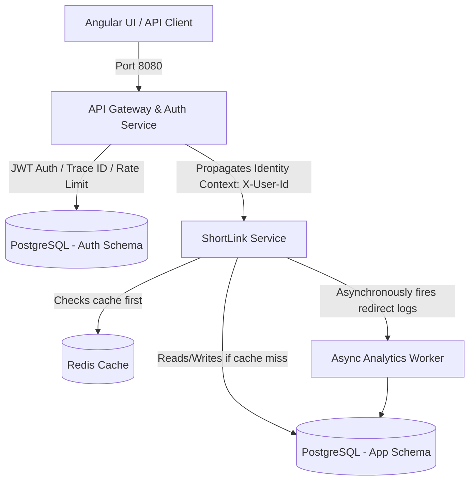

# ShortLinkX - Enterprise Distributed URL Shortener

ShortLinkX is a production-grade, distributed microservice platform built to shorten URLs, provide high-performance redirection, gather link telemetry, and secure client access.

## Repository Information
* **Repository URL**: [ShortlinkX on GitHub](https://github.com/vinaykumaru2k3/ShortlinkX.git)

---

## Architecture Overview

The system is structured as a Maven multi-module project comprising the following modules:

```
ShortLinkX/
  ├── common/             # Shared classes (DTOs, Exception models, Trace Filters)
  ├── api-gateway/        # Edge Routing, Spring Security, JWT validation, Resilience4j, Rate Limiting
  ├── shortlink-service/  # Core Business Logic, Base62 generation, PostgreSQL, Redis cache, Async Analytics
  └── frontend/           # Angular 17+ Single-Page Application (SPA) dashboard client
```

### System Architecture Diagram


---

## Key Features

1. **Edge Router & Security Gateway**: Central gateway on port `8080` intercepts all traffic, validates JWT authorization tokens, configures CORS/CSRF guards, and forwards requests.
2. **Identity Header Propagation**: Once verified, the gateway extracts the caller's details and forwards them downstream to the microservices using secure custom headers (`X-User-Id`), keeping backend services stateless.
3. **Link History per User**: Users can view their personalized list of generated URLs and telemetry data in the dashboard.
4. **Log Tracing (Correlation IDs)**: Log tracing propagates a unique `X-Correlation-ID` MDC context from Gateway down to Services to ease debugging in production.
5. **Sub-millisecond Redirections (Redis Cache)**: Caches `shortCode -> originalUrl` mappings in Redis with configurable TTL expirations.
6. **Asynchronous Link Telemetry**: Redirection lookups immediately redirect the user, while tracking metrics (geography, referral, OS, browser) asynchronously in a non-blocking background thread.
7. **Resilience & Fallbacks (Circuit Breaker)**: Utilizes Resilience4j on Gateway routes to automatically handle downstream microservice outages and fail gracefully.
8. **Flyway Migrations**: Production-grade version-controlled SQL scripts define schema setups instead of unsafe Hibernate auto-generations.

---

## Tech Stack

* **Language**: Java 21
* **Framework**: Spring Boot 4.0.6 (and corresponding Spring Cloud)
* **Frontend**: Angular 17+ (TypeScript, SCSS)
* **Database**: PostgreSQL (JPA/Hibernate)
* **Cache & Rate-limiting**: Redis (Reactive & Standard)
* **API Documentation**: Springdoc OpenAPI (Swagger UI integrated at Gateway)
* **Testing**: JUnit 5, Mockito, Spring Boot Test
* **Containerization**: Docker, Docker Compose
* **CI/CD**: GitHub Actions

---

## Getting Started

### Prerequisites
* **Docker & Docker Compose** (Desktop/Engine v20.10+)
* **Java 21 JDK** (to compile/run locally without containers)
* **Node.js & npm** (optional, for running/developing the frontend locally)
* **Maven 3.9+** (optional, wrapper `./mvnw` is included)

### Running the Complete Stack (Docker Compose)
The entire multi-service system is orchestrated using Docker Compose. This starts all database engines, the Redis cache, backend services, and the Angular frontend.

1. **Clone the repository**:
   ```bash
   git clone https://github.com/vinaykumaru2k3/ShortlinkX.git
   cd ShortlinkX
   ```

2. **Boot the platform**:
   ```bash
   docker compose up --build
   ```
   *This command compiles the Java microservices, builds the Angular client inside an Nginx container, starts PostgreSQL instances for auth and link databases, provisions Redis, and links them all.*

3. **Access Services**:
   * **Frontend UI Dashboard**: [http://localhost:4200](http://localhost:4200) (routes calls automatically to the gateway)
   * **API Gateway Service**: [http://localhost:8080](http://localhost:8080)
   * **Swagger OpenAPI Documentation**: [http://localhost:8080/swagger-ui.html](http://localhost:8080/swagger-ui.html)
   * **PostgreSQL (Auth DB)**: Port `5430` (DB name: `shortlink_auth`, username: `postgres`, password: `password`)
   * **PostgreSQL (URL DB)**: Port `5431` (DB name: `shortlink_urls`, username: `postgres`, password: `password`)
   * **Redis Cache Server**: Port `6379`

---

## Local Development & Component-Specific Execution

### Backend Microservices
If you wish to run backend services locally outside Docker:
1. Spin up Postgres and Redis databases:
   ```bash
   docker compose up -d postgres-auth postgres-url redis
   ```
2. Start the API Gateway:
   ```bash
   cd api-gateway
   ./../mvnw spring-boot:run
   ```
3. Start the ShortLink Service:
   ```bash
   cd shortlink-service
   ./../mvnw spring-boot:run
   ```

### Frontend (Angular UI)
To run the Angular SPA in development mode:
1. Navigate to the frontend directory:
   ```bash
   cd frontend
   ```
2. Install dependencies:
   ```bash
   npm install
   ```
3. Start the local server:
   ```bash
   npm start
   ```
   *The client will start on [http://localhost:4200](http://localhost:4200) with hot-reloading enabled and will proxy API calls to the Gateway on `http://localhost:8080` automatically via `proxy.conf.json`.*

---

## Testing & Quality Assurance

### Running JUnit Tests
We use JUnit 5 and Mockito for unit and integration testing. Both backend modules (`api-gateway` and `shortlink-service`) are configured to run tests using an isolated H2 in-memory database to prevent test contamination.

To execute the test suite:
```bash
./mvnw clean test
```
*This command cleans previous outputs, compiles all modules, and runs all unit & integration tests. The pipeline will output a `BUILD SUCCESS` report showing zero test failures.*

---

## Postman API Verification
A pre-configured Postman collection is available at `postman/ShortLinkX.postman_collection.json`.

### Importing and Running:
1. Open Postman.
2. Click **Import** and select the file [ShortLinkX.postman_collection.json](file:///d:/ShortLinkX/postman/ShortLinkX.postman_collection.json).
3. The collection contains pre-configured requests for registering, logging in, shortening URLs, and retrieving history.
4. **JWT Automation**: The `Login` request contains a test script that automatically extracts the returned JWT and saves it as a collection variable `jwt_token`. Subsequent requests pass this variable in the Authorization header (`Bearer {{jwt_token}}`) automatically.

---

## API Documentation

APIs are unified and exposed through the gateway on port `8080`:

| Method | Endpoint | Description | Auth Required |
| :--- | :--- | :--- | :--- |
| `POST` | `/api/v1/auth/register` | Register a new user account | No |
| `POST` | `/api/v1/auth/login` | Login and obtain a JWT bearer token | No |
| `POST` | `/api/v1/shorten` | Generate a new base62 shortened URL | Yes (JWT) |
| `GET` | `/api/v1/urls` | Retrieve history of shortened links for user | Yes (JWT) |
| `GET` | `/api/v1/{shortCode}` | Resolve and redirect short URL | No |
| `GET` | `/v3/api-docs` | Fetch OpenAPI specifications JSON | No |
